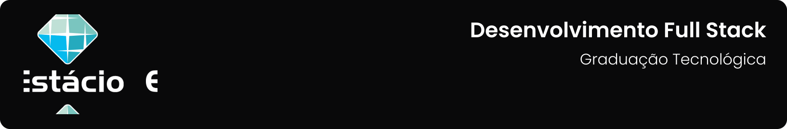

Repositório destinado ao compartilhamento dos códigos gerados no curso de graduação tecnológica em **`Desenvolvimento Full Stack`** da **[`Estácio`]**(https://estacio.br/inscricao/formulario?cod_agente=14369444&u=177546).

 

---

[Navegação](#-navegação) • [Como baixar e executar](#-como-baixar-e-executar) • [Licença](#-licença)

---

## 🧭 Navegação
O curso, apesar de ser divididos em semestres, é estruturado em Mundos, cada Mundo composto por Níveis, disciplinas, que o integram e dispõem o seu conteúdo, incluindo Missões Conceituais, Checkpoints e Missões Práticas. Neste repositório, estarão listadas somente as missões práticas. Portanto, os códigos estarão divididos por Mundo e Nível.

---

[Mundo 1](./mundo1/)

---

## 📥 Como baixar e executar
Para baixar os arquivos deste repositório, você deve ter o [GitHub](https://github.com/) instalado em seu dispositivo.

Após instalado, você deverá acessar a guia `Arquivo` → `Clonar repositório` → `URL` e incluir o caminho `guedesert/desenvolvimento-full-stack`.

Além disso, é interessante que você tenha um bom editor para trabalhar com os códigos. Recomendo o uso do [Visual Studio Code](https://code.visualstudio.com/), por exemplo.

Para conferir as ferramentas que foram utilizadas, siga para o diretório de cada mundo.

## 📃 Licença
Este repositório está licensiado sob a [Licença MIT](./LICENSE).
Copyright © 2022-2023 Emanuel Guedes.

---

Criado com ❤ por [**Emanuel Guedes**](https://br.linkedin.com/in/guedesert)

