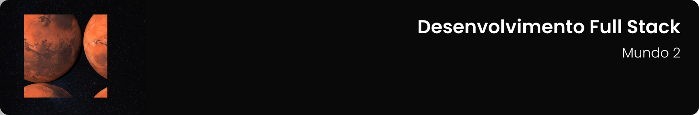

## 

---

[Nível 1](#nível-1-meu-primeiro-site-cringe-) • [Nível 2](#nível-2-descobrindo-o-javascript-) • [Nível 3](#nível-3-meu-primeiro-framework-) • [Nível 4](#nível-4-conhecendo-outro-framework-) • [Nível 5](#nível-5-vamos-colocar-o-framework-para-acessar-um-banco) • [Missão Certificação](#missão-certificação-projeto-front-end-com-framework-e-crud-) • [Tecnologias utilizadas](#-tecnologias-utilizadas-neste-mundo)

---

## Nível 1: Meu Primeiro Site Cringe [🗂](https://github.com/guedesert/meu-primeiro-site-cringe)

`Objetivos:` Identificar a evolução e importância da interface de um Website; Reconhecer os aspectos fundamentais das redes de computadores e histórico da Internet; Identificar os elementos da linguagem de marcação de hipertexto - HTML; Reconhecer os elementos básicos da linguagem de marcação e estilos - CSS; Identificar os aspectos básicos do ambiente web cliente x servidor e as tecnologias.

## Nível 2: Descobrindo o JavaScript [🗂](https://github.com/guedesert/descobrindo-o-javascript)

`Objetivos:` Reconhecer os principais aspectos para o planejamento de um Website; Identificar as camadas de aplicação e transporte; Identificar os elementos da linguagem JavaScript; Reconhecer os elementos básicos da tecnologias de transmissão de dados em sistemas web; Reconhecer os elementos fundamentais da programação cliente com TypeScript; Identificar os principais aspectos do Vue.js.

## Nível 3: Meu Primeiro Framework [🗂](https://github.com/guedesert/meu-primeiro-framework)

`Objetivos:` Reconhecer os principais aspectos conceituais de um website; Identificar os elementos de validação de dados; Reconhecer os elementos básicos de ergonomia em interação humano computador; Reconhecer os elementos fundamentais do React; Identificar os principais aspectos do Next.js.

## Nível 4: Conhecendo Outro Framework [🗂](https://github.com/guedesert/conhecendo-outro-framework)

`Objetivos:` Reconhecer os principais aspectos de estruturação de um website; Identificar os elementos de controle de versionamento; Reconhecer os elementos básicos para o desenvolvimento de interface humano-computador; Reconhecer os elementos fundamentais do Angular; Identificar os principais aspectos do pré-processador de CSS - SASS

## Nível 5: Vamos Colocar o Framework Para Acessar um Banco [🗂](https://github.com/guedesert/vamos-colocar-o-framework-para-acessar-um-banco)

`Objetivos:` Reconhecer os principais aspectos para criação de um website; Identificar os elementos para avaliação de interface humano-computador; Reconhecer os elementos básicos de acessibilidade à web; Reconhecer os elementos fundamentais de um sistema de banco de dados; Identificar os principais aspectos do JavaScript na web: CRUD com JavaScript assíncrono.

## Missão Certificação: Projeto Front-end com Framework e Crud [🗂](https://github.com/guedesert/projeto-front-end-com-framework-e-crud)

`Objetivos:` Aplicar os principais aspectos de estruturação e criação de um website; Desenvolver os elementos da linguagem de marcação de hipertexto - HTML e estilos - CSS; Desenvolver os elementos da linguagem JavaScript; Desenvolver um projeto utilizando React ou Angular; Aplicar os elementos para avaliação de interface humano-computador.

## 🛠 Tecnologias utilizadas neste Mundo

Para a construção e execução dos códigos visualizados nos níveis do Mundo 2 foram utilizadas as seguintes tecnologias:

        

